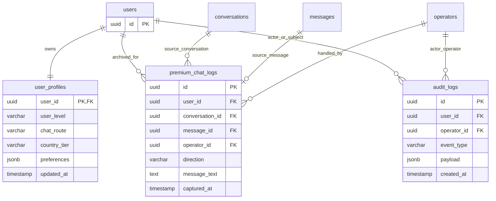

# P1-01 DB Schema Design

Status: draft for review
Task: P1-01 - design `user_profiles` / `premium_chat_logs` / `audit_logs`
Source: `docs/product/business-flow.html` and `docs/product/execution-plan.html`

## Scope

This document is the schema contract for P1-02 (`Flyway V1__init.sql`). It
does not replace the current runtime schema yet. The next migration task should
translate the tables below into executable DDL, including indexes, foreign keys,
and CHECK constraints.

P1-01 covers three core tables:

- `user_profiles`: one mutable profile row per user, including segmentation
  fields used by the level engine and chat routing.
- `premium_chat_logs`: append-only archive of S/A premium chat messages for
  operator review and later monetization analysis.
- `audit_logs`: append-only operational event ledger for inbound queue,
  routing, moderation, billing, and operator actions.

## ER Diagram



## Table: `user_profiles`

Purpose: the canonical profile row used by onboarding, prompt building,
segmentation, and routing. One row per `users.id`.

| Column | Type | Required | Default | Notes |
|---|---:|---:|---:|---|
| `user_id` | `uuid` | yes | - | PK, FK `users(id) ON DELETE CASCADE` |
| `current_character_id` | `uuid` | no | - | FK to `characters(id)` once characters are seeded |
| `preferences` | `jsonb` | yes | `'{}'` | Onboarding progress, current intent, lightweight flags |
| `interests` | `jsonb` | yes | `'[]'` | User-declared interests |
| `emotional_patterns` | `jsonb` | yes | `'{}'` | Derived emotional patterns |
| `chat_style` | `varchar(30)` | no | - | `warm`, `casual`, `intellectual`, etc. |
| `forbidden_topics` | `jsonb` | yes | `'[]'` | User-declared boundaries |
| `relationship_stage` | `varchar(10)` | yes | `'S0'` | Existing prompt layer input |
| `risk_score` | `integer` | yes | `0` | 0-100 risk band input |
| `vip_level` | `integer` | yes | `0` | Existing VIP signal |
| `reported_age` | `integer` | no | - | AI/user extracted age, if confidence allows |
| `reported_age_confidence` | `numeric(5,4)` | no | - | 0.0000-1.0000 |
| `age_band` | `varchar(20)` | yes | `'unknown'` | `unknown`, `under_18`, `18_24`, `25_34`, `35_44`, `45_plus` |
| `country_code` | `char(2)` | no | - | ISO-3166 alpha-2 where known |
| `country_tier` | `varchar(20)` | yes | `'unknown'` | `T1`, `T2`, `T3`, `unknown` |
| `total_spent_cents` | `integer` | yes | `0` | Denormalized billing signal for level engine |
| `last_paid_at` | `timestamp` | no | - | Latest successful payment timestamp |
| `user_level` | `varchar(1)` | yes | `'D'` | `S`, `A`, `B`, `C`, `D`; computed in P2 |
| `chat_route` | `varchar(30)` | yes | `'ai_auto'` | `manual_premium`, `ai_assisted`, `ai_auto` |
| `level_reason` | `jsonb` | yes | `'{}'` | Explainable inputs for last level decision |
| `level_updated_at` | `timestamp` | no | - | Last level recalculation time |
| `initiation_score` | `float` | yes | `0` | Existing loneliness input |
| `emotion_score` | `float` | yes | `0` | Existing loneliness input |
| `retention_score` | `float` | yes | `0` | Existing loneliness input |
| `dependency_score` | `float` | yes | `0` | Existing loneliness input |
| `loneliness_score` | `float` | yes | `35` | Existing prompt layer input |
| `score_stage` | `varchar(20)` | yes | `'cold_start'` | Existing scoring state |
| `trigger_threshold` | `float` | yes | `65` | Existing reactivation threshold |
| `score_updated_at` | `timestamp` | no | - | Last score refresh |
| `notes` | `text` | no | - | Internal notes only; do not store secrets |
| `created_at` | `timestamp` | yes | `now()` | New row creation time |
| `updated_at` | `timestamp` | yes | `now()` | Updated by application/migration trigger |

Required constraints:

- `PRIMARY KEY (user_id)`.
- `FOREIGN KEY (user_id) REFERENCES users(id) ON DELETE CASCADE`.
- `CHECK (risk_score BETWEEN 0 AND 100)`.
- `CHECK (vip_level >= 0)`.
- `CHECK (reported_age IS NULL OR reported_age BETWEEN 13 AND 120)`.
- `CHECK (reported_age_confidence IS NULL OR reported_age_confidence BETWEEN 0 AND 1)`.
- `CHECK (country_tier IN ('T1', 'T2', 'T3', 'unknown'))`.
- `CHECK (user_level IN ('S', 'A', 'B', 'C', 'D'))`.
- `CHECK (chat_route IN ('manual_premium', 'ai_assisted', 'ai_auto'))`.
- `CHECK (total_spent_cents >= 0)`.

Recommended indexes:

- `idx_user_profiles_level_route_updated` on `(user_level, chat_route, updated_at DESC)`.
- `idx_user_profiles_country_tier` on `(country_tier)`.
- `idx_user_profiles_loneliness` on `(loneliness_score DESC)` where `loneliness_score IS NOT NULL`.
- `idx_user_profiles_current_character` on `(current_character_id)` where `current_character_id IS NOT NULL`.

Compatibility note: the current `scripts/init.sql` already contains a partial
`user_profiles` table. P1-02 should preserve those columns and add the P1/P2
segmentation fields above.

## Table: `premium_chat_logs`

Purpose: archive every inbound and outbound message for S/A users after the
premium routing decision. Writes must be append-only from the application point
of view. The table intentionally duplicates `message_text` from `messages` so
that premium review remains stable even if the source message is later redacted
or moved.

| Column | Type | Required | Default | Notes |
|---|---:|---:|---:|---|
| `id` | `uuid` | yes | `uuid_generate_v4()` | PK |
| `user_id` | `uuid` | yes | - | FK `users(id)` |
| `conversation_id` | `uuid` | yes | - | FK `conversations(id)` |
| `message_id` | `uuid` | no | - | FK `messages(id)`, nullable for imported/manual rows |
| `operator_id` | `uuid` | no | - | FK `operators(id)`, set for human/operator messages |
| `direction` | `varchar(10)` | yes | - | `inbound` or `outbound` |
| `sender_type` | `varchar(20)` | yes | - | `user`, `assistant`, `operator`, `system` |
| `message_text` | `text` | yes | - | Archived message body; access should be admin-only |
| `content_type` | `varchar(20)` | yes | `'text'` | Mirrors message content type |
| `user_level_at_capture` | `varchar(1)` | yes | - | Expected `S` or `A`, but allows all levels for audit repair |
| `chat_route_at_capture` | `varchar(30)` | yes | - | Route used when captured |
| `script_hit_id` | `uuid` | no | - | Reserved for P1-16/P3 script attribution |
| `metadata` | `jsonb` | yes | `'{}'` | Safe operational metadata only |
| `trace_id` | `varchar(64)` | no | - | Request/job trace |
| `captured_at` | `timestamp` | yes | `now()` | Archive timestamp |
| `created_at` | `timestamp` | yes | `now()` | Row creation time |

Required constraints:

- `PRIMARY KEY (id)`.
- `FOREIGN KEY (user_id) REFERENCES users(id) ON DELETE CASCADE`.
- `FOREIGN KEY (conversation_id) REFERENCES conversations(id) ON DELETE CASCADE`.
- `FOREIGN KEY (message_id) REFERENCES messages(id) ON DELETE SET NULL`.
- `FOREIGN KEY (operator_id) REFERENCES operators(id) ON DELETE SET NULL`.
- `CHECK (direction IN ('inbound', 'outbound'))`.
- `CHECK (sender_type IN ('user', 'assistant', 'operator', 'system'))`.
- `CHECK (user_level_at_capture IN ('S', 'A', 'B', 'C', 'D'))`.
- `CHECK (chat_route_at_capture IN ('manual_premium', 'ai_assisted', 'ai_auto'))`.

Recommended indexes:

- `idx_premium_chat_logs_user_captured` on `(user_id, captured_at DESC)`.
- `idx_premium_chat_logs_conversation_captured` on `(conversation_id, captured_at DESC)`.
- `idx_premium_chat_logs_operator_captured` on `(operator_id, captured_at DESC)` where `operator_id IS NOT NULL`.
- `idx_premium_chat_logs_message` unique on `(message_id)` where `message_id IS NOT NULL`.
- `idx_premium_chat_logs_trace_id` on `(trace_id)` where `trace_id IS NOT NULL`.

Retention/access notes:

- Do not write this table for minors or suspected minors.
- Do not expose this table to normal API users.
- Consider a later retention policy before public beta; this task only defines
  the table shape.

## Table: `audit_logs`

Purpose: append-only event ledger for operational traceability. This is the
database counterpart to structured JSON logs, not a place for raw user content.
It should support queries like "show the latest 100 inbound queue writes" and
"show every routing decision for this user/conversation".

| Column | Type | Required | Default | Notes |
|---|---:|---:|---:|---|
| `id` | `uuid` | yes | `uuid_generate_v4()` | PK |
| `trace_id` | `varchar(64)` | no | - | Same trace ID as application logs |
| `event_type` | `varchar(80)` | yes | - | Dot-delimited event name |
| `component` | `varchar(40)` | yes | - | `api`, `telegram`, `messages`, `routing`, `payments`, etc. |
| `result` | `varchar(30)` | no | - | `success`, `failed`, `blocked`, `duplicate`, etc. |
| `user_id` | `uuid` | no | - | FK `users(id)` if event is user-scoped |
| `conversation_id` | `uuid` | no | - | FK `conversations(id)` |
| `message_id` | `uuid` | no | - | FK `messages(id)` |
| `operator_id` | `uuid` | no | - | FK `operators(id)` |
| `script_hit_id` | `uuid` | no | - | Reserved for script attribution |
| `actor_type` | `varchar(20)` | yes | `'system'` | `system`, `user`, `operator`, `provider` |
| `actor_id` | `varchar(100)` | no | - | External actor reference; hash/redact if sensitive |
| `payload` | `jsonb` | yes | `'{}'` | Redacted operational payload |
| `payload_hash` | `char(64)` | no | - | Optional SHA-256/HMAC for tamper checks |
| `created_at` | `timestamp` | yes | `now()` | Append timestamp |

Required constraints:

- `PRIMARY KEY (id)`.
- `FOREIGN KEY (user_id) REFERENCES users(id) ON DELETE SET NULL`.
- `FOREIGN KEY (conversation_id) REFERENCES conversations(id) ON DELETE SET NULL`.
- `FOREIGN KEY (message_id) REFERENCES messages(id) ON DELETE SET NULL`.
- `FOREIGN KEY (operator_id) REFERENCES operators(id) ON DELETE SET NULL`.
- `CHECK (event_type <> '')`.
- `CHECK (component IN ('api', 'telegram', 'messages', 'routing', 'llm', 'handoff', 'ws', 'notifications', 'payments', 'admin', 'system'))`.
- `CHECK (result IS NULL OR result IN ('success', 'failed', 'blocked', 'duplicate', 'timeout', 'fallback', 'ignored'))`.
- `CHECK (actor_type IN ('system', 'user', 'operator', 'provider'))`.

Recommended indexes:

- `idx_audit_logs_created` on `(created_at DESC)`.
- `idx_audit_logs_event_created` on `(event_type, created_at DESC)`.
- `idx_audit_logs_user_created` on `(user_id, created_at DESC)` where `user_id IS NOT NULL`.
- `idx_audit_logs_conversation_created` on `(conversation_id, created_at DESC)` where `conversation_id IS NOT NULL`.
- `idx_audit_logs_trace_id` on `(trace_id)` where `trace_id IS NOT NULL`.
- `idx_audit_logs_script_hit` on `(script_hit_id)` where `script_hit_id IS NOT NULL`.

Immutability rules:

- Application code may `INSERT` only.
- No application endpoint should update or delete rows.
- DB role separation in P1-04 should prevent app roles from `DROP` and should
  keep destructive audit-table permissions out of the runtime account.
- If hard immutability is required later, add a trigger that rejects `UPDATE` and
  `DELETE` for non-migration roles.

Sensitive-data rules:

- Do not store raw message text in `audit_logs.payload`.
- Do not store tokens, signatures, cookies, payment card data, or raw provider
  payloads.
- Store IDs only when they are internal UUIDs or already redacted/hardened.
- Put message content in `messages` or `premium_chat_logs`, never audit payloads.

## DDL Skeleton for P1-02

P1-02 can translate this skeleton into `V1__init.sql`:

```sql
CREATE EXTENSION IF NOT EXISTS "uuid-ossp";

CREATE TABLE user_profiles (...);
CREATE INDEX ...;

CREATE TABLE premium_chat_logs (...);
CREATE INDEX ...;

CREATE TABLE audit_logs (...);
CREATE INDEX ...;
```

When converting to Flyway:

- Use `TIMESTAMP` or `TIMESTAMPTZ` consistently with the rest of the repo. The
  current schema uses `TIMESTAMP`; a future cleanup can standardize to
  `TIMESTAMPTZ`.
- Keep `CREATE TABLE IF NOT EXISTS` only if the migration strategy supports
  repeatable local bootstraps. Flyway versioned migrations usually use plain
  `CREATE TABLE`.
- Add comments with `COMMENT ON TABLE` / `COMMENT ON COLUMN` if desired, but do
  not depend on comments for application behavior.

## Acceptance Checklist

- [x] `user_profiles` includes `user_level`, `chat_route`, and `country_tier`.
- [x] `premium_chat_logs` includes foreign keys, direction, message archive,
  operator, trace, and lookup indexes.
- [x] `audit_logs` supports append-only event capture, recent 100 lookups,
  `script_hit_id` reservation, trace lookup, and redacted payloads.
- [x] ER relationships are documented.
- [x] Constraints and indexes are specified for P1-02 migration work.
